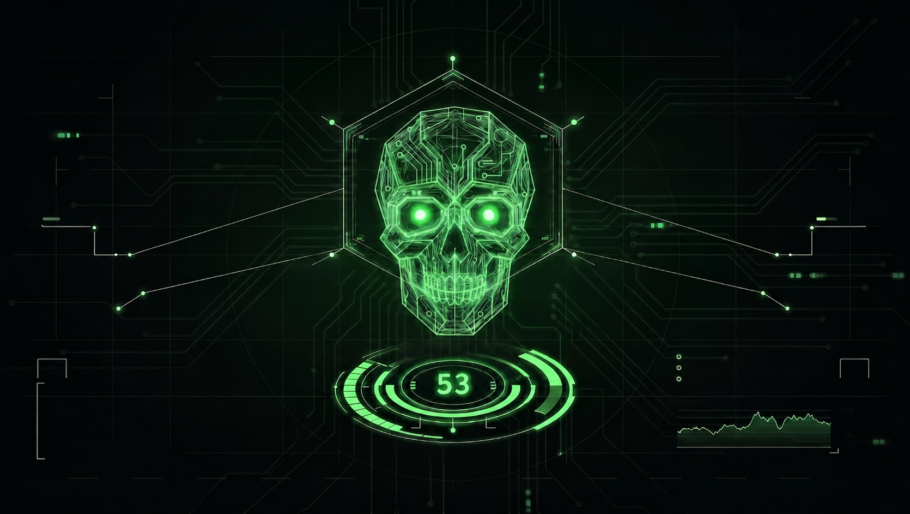

<div align="center">
  
  <h1>Cipher-Sync v2.0</h1>
  <p><b>Distributed Zero-Knowledge Steganographic Vault</b></p>
</div>

---

**Lead Researcher & Developer:** Ahmad Abu Zayed  
**Project Context:** Independent Cybersecurity and Computer Science Research.

## 📌 Overview
Cipher-Sync is an advanced cybersecurity engine designed to weave highly encrypted payloads into the frequency domain of standard JPEG images. Operating as a zero-knowledge local vault, it allows users to obscure sensitive data within the mathematical noise of ordinary photos without altering the image's visual integrity or triggering standard forensic statistical anomalies. 

Version 2.0 introduces a **Distributed Vault Architecture** utilizing Shamir's Secret Sharing to shatter payloads across multiple carrier matrices, ensuring absolute data destruction if the recovery threshold is unmet.

---

## 📷 Interface & Usability
*(Insert a screenshot of your sleek green/dark-mode GUI here by uploading it to your repo and linking it: ``)*

Cipher-Sync features a modern, hardware-accelerated graphical interface built with `CustomTkinter`, allowing seamless transition between standard 1-to-1 matrix injection and distributed N-of-M cryptographic shattering.

---

## ⚙️ Core Architecture & Mathematics

This engine implements a multi-layered, mathematically rigorous security pipeline:

### Phase 1: Cryptography & Armor
* **Encryption:** AES-256-GCM authenticated encryption utilizing high-iteration PBKDF2 key derivation to lock the raw payload.
* **Error Correction:** Reed-Solomon GF(2^8) mathematical armor is wrapped around the ciphertext to auto-heal bit-flips caused by minor carrier matrix corruption.

### Phase 2: Matrix Hooking & Scatter (The 1-to-1 Vault)
* **Path Generation:** Deterministic Pseudo-Random Number Generation (PRNG), seeded by SHA-256 hashes of the master key, distributes data chaotically across the image matrix to defeat localized Steganalysis.
* **Quantized DCT Injection:** Bypasses standard image compression by injecting directly into Quantized Discrete Cosine Transform mid-frequency coefficients via `libjpeg-turbo`.

### Phase 3: Distributed Network (Shamir's Secret Sharing)
* **Fragmentation:** Polling payload data as the y-intercept of a polynomial over a finite Galois Field, shattering the data into N distinct shares.
* Requires a strict threshold (M) of localized images to successfully reconstruct the polynomial. Compromising M-1 images yields absolute cryptographic noise.

---

## 🚀 Installation & Usage

**Prerequisites:** Python 3.8+ and standard build tools for `libjpeg-turbo`.

```bash
# 1. Clone the repository
git clone [https://github.com/Ahmad-53-Xx/Cipher-Sync.git](https://github.com/Ahmad-53-Xx/Cipher-Sync.git)
cd Cipher-Sync

# 2. Install required mathematical and UI dependencies
pip install -r requirements.txt

# 3. Launch the Core Engine
python3 app_gui.py
```
---
## 🔮 Future Work & Research Roadmap
As this independent research continues, future iterations of the architecture will target the following theoretical upgrades:

* LZMA / Zlib Compression Pipeline: Pre-encryption lossless compression to vastly expand the payload capacity of smaller carrier matrices.

* Argon2 Key Derivation: Upgrading the PRNG and AES seed generation to memory-hard hashing algorithms to ensure absolute immunity to brute-force dictionary attacks.

* Syndrome Trellis Codes (STC): Implementing Hamming matrix mathematics to hide multiple bits of data per single altered DCT coefficient, radically reducing the overall distortion payload.

# Disclaimer: This tool was developed strictly for academic research and authorized cryptographic defense. The author is not responsible for the misuse of this software.
